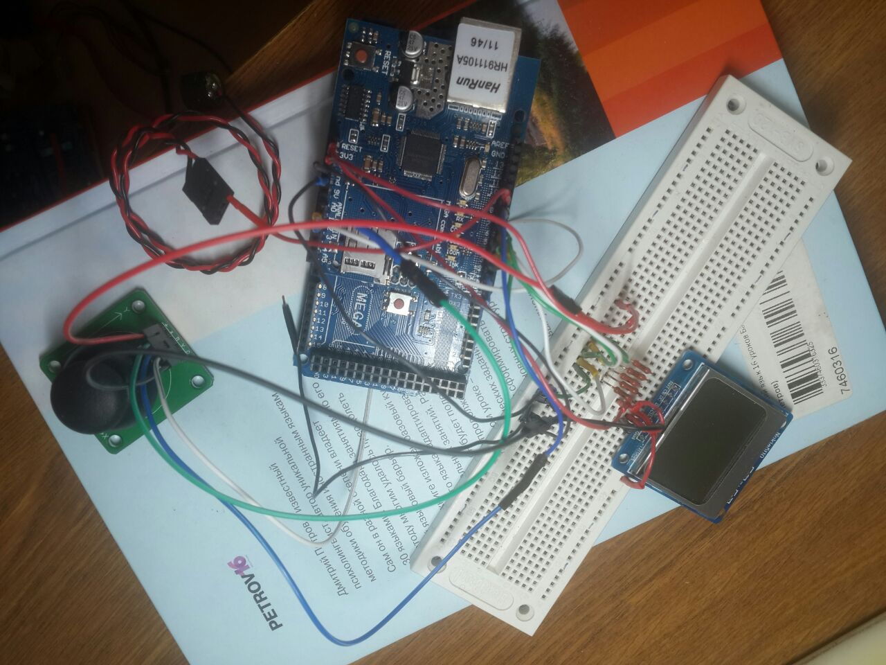
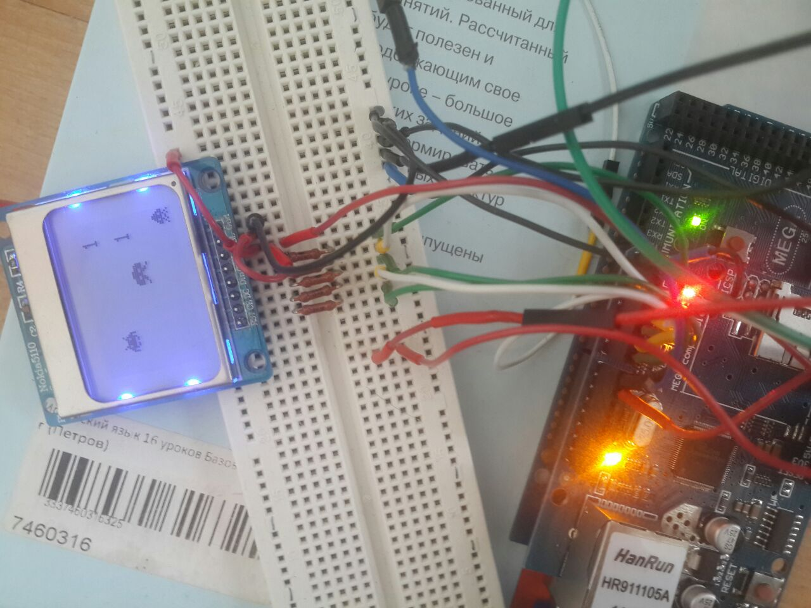
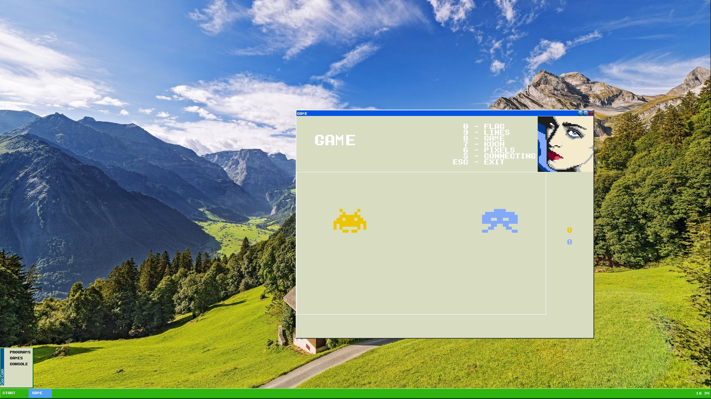

# Игра на микроконтроллере ATmega328

Микроконтроллер ATmega328 соединяется по локальной сети с персональным компьютером:

Первый игрок играет на микроконтроллере:

Второй игрок играет на компьютере:

Суть игры: на черно-белом дисплее Nokia 5110 бегают инопланетные существа. Игра осуществляется по сети (TCP) двумя игроками. Задача каждого поймать как можно больше инопланетных существ.

Состоит из:
- микроконтроллер ATmega328
- черно-белый дисплей Nokia 5110
- аналоговый 2D джойстик 
- динамик для вывода музыки и звуков игры
- сетевой (LAN) контроллер W5500

Написан на C++ в среде Arduino.

Статус проекта: Завершен.

## Лицензия
Copyright (c) 2022 Evgeny Goryachev  
Gor.Com 